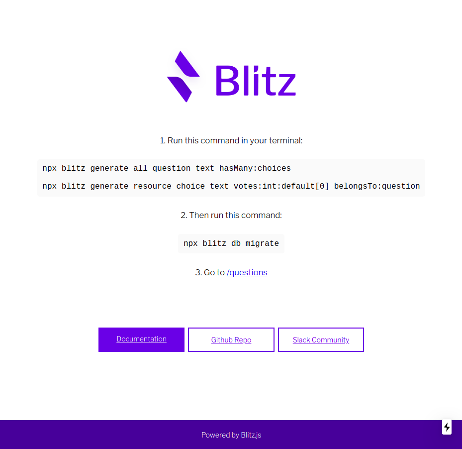
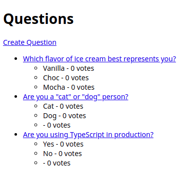

# Basic Voting App

A basic voting application created using [Blitz.js](https://blitzjs.com/).

Blitz is the fullstack React framework — built on Next.js.





---

## Getting Started

Install Blitz:

```sh
$ npm i blitz

$ npx blitz -v
Linux 4.4 | linux-x64 | Node: v12.16.0

blitz: 0.16.0 (global)
blitz: 0.16.0 (local)
```

Create a new app:

```sh
$ npx blitz new blitz-voting
You are using alpha software - if you have any problems, please open an issue here:
  https://github.com/blitz-js/blitz/issues/new/choose


Hang tight while we set up your new Blitz app!

CREATE    .babelrc.js
CREATE    .env
CREATE    .eslintrc.js
CREATE    .npmrc
CREATE    .prettierignore
CREATE    README.md
CREATE    app/components/.keep
CREATE    app/components/ErrorBoundary.tsx
CREATE    app/layouts/.keep
CREATE    app/pages/_app.tsx
CREATE    app/pages/_document.tsx
CREATE    app/pages/index.tsx
CREATE    blitz.config.js
CREATE    db/index.ts
CREATE    db/migrations/.keep
CREATE    db/schema.prisma
CREATE    integrations/.keep
CREATE    package.json
CREATE    public/favicon.ico
CREATE    public/logo.png
CREATE    tsconfig.json
CREATE    utils/.keep
CREATE    .gitignore

✔ Retrieving the freshest of dependencies
✔ Resolving packages
✔ Fetching packages
✔ Linking dependencies
✔ Building fresh packages
✔ Formatting your code

Your new Blitz app is ready! Next steps:

   1. cd myapp
   2. blitz start
   3. You create new pages by placing components inside app/pages/
```

Start the dev server.

```sh
$ npx blitz start
You are using alpha software - if you have any problems, please open an issue here:
  https://github.com/blitz-js/blitz/issues/new/choose

✔ Prepped for launch
ready - started server on http://localhost:3000
warn  - You have enabled experimental feature(s).
warn  - Experimental features are not covered by semver, and may cause unexpected or broken application behavior. Use them at your own risk.

> Using "webpackDevMiddleware" config function defined in default.
> Using external babel configuration
> Location: "/home/cedric/m/dev/scratch/blitzjs-app/.blitz/caches/dev/.babelrc.js"
event - compiled successfully
wait  - compiling...
Attention: Next.js now collects completely anonymous telemetry regarding usage.
This information is used to shape Next.js' roadmap and prioritize features.
You can learn more, including how to opt-out if you'd not like to participate in this anonymous program, by visiting the following URL:
https://nextjs.org/telemetry

event - compiled successfully
... ... ...
... ... ...
event - build page: /
wait  - compiling...
event - compiled successfully
event - build page: /next/dist/pages/_error
wait  - compiling...
event - compiled successfully
```

Open [http://localhost:3000](http://localhost:3000) with your browser to see the result.

### Generating content

First, we'll generate everything pertaining to the `Question` model:

```sh
$ npx blitz generate all question text hasMany:choices
✔ Model for 'question' created successfully:

> model Question {
>   id        Int      @default(autoincrement()) @id
>   createdAt DateTime @default(now())
>   updatedAt DateTime @updatedAt
>   text      String
>   choices   Choice[]
> }

Now run blitz db migrate to add this model to your database

CREATE    app/questions/pages/questions/[questionId]/edit.tsx
CREATE    app/questions/pages/questions/[questionId].tsx
CREATE    app/questions/pages/questions/index.tsx
CREATE    app/questions/pages/questions/new.tsx
CREATE    app/questions/components/QuestionForm.tsx
CREATE    app/questions/queries/getQuestion.ts
CREATE    app/questions/queries/getQuestions.ts
CREATE    app/questions/mutations/createQuestion.ts
CREATE    app/questions/mutations/deleteQuestion.ts
CREATE    app/questions/mutations/updateQuestion.ts
```

Then, we'll generate the `Choice` model with corresponding queries and mutations:

```sh
$ npx blitz generate resource choice text votes:int:default[0] belongsTo:question
✔ Model for 'choice' created successfully:

> model Choice {
>   id         Int      @default(autoincrement()) @id
>   createdAt  DateTime @default(now())
>   updatedAt  DateTime @updatedAt
>   text       String
>   votes      Int      @default(0)
>   question   Question @relation(fields: [questionId], references: [id])
>   questionId Int
> }

Now run blitz db migrate to add this model to your database

CREATE    app/choices/queries/getChoice.ts
CREATE    app/choices/queries/getChoices.ts
CREATE    app/choices/mutations/createChoice.ts
CREATE    app/choices/mutations/deleteChoice.ts
CREATE    app/choices/mutations/updateChoice.ts
```

Now, we need to migrate our database:

```sh
$ npx blitz db migrate
✔ Name of migration … init db
📼  migrate save --name init db

New datamodel:

// This is your Prisma schema file,
// learn more about it in the docs: https://pris.ly/d/prisma-schema

datasource sqlite {
  provider = "sqlite"
  url      = "file:./db.sqlite"
}

// SQLite is easy to start with, but if you use Postgres in production
// you should also use it in development with the following:
//datasource postgresql {
//  provider = "postgresql"
//  url      = env("DATABASE_URL")
//}

generator client {
  provider = "prisma-client-js"
}


// --------------------------------------

model Question {
  id        Int      @default(autoincrement()) @id
  createdAt DateTime @default(now())
  updatedAt DateTime @updatedAt
  text      String
  choices   Choice[]
}

model Choice {
  id         Int      @default(autoincrement()) @id
  createdAt  DateTime @default(now())
  updatedAt  DateTime @updatedAt
  text       String
  votes      Int      @default(0)
  question   Question @relation(fields: [questionId], references: [id])
  questionId Int
}


Prisma Migrate just created your migration 20200702230723-init-db in

migrations/
  └─ 20200702230723-init-db/
    └─ steps.json
    └─ schema.prisma
    └─ README.md

Run prisma migrate up --experimental to apply the migration

🏋️  migrate up

Datamodel that will initialize the db:

... ... ...
... ... ...

Checking the datasource for potential data loss...

Database Changes:

Migration               Database actionsStatus

20200702230723-init-db   statements.  Done 🚀

You can get the detailed db changes with prisma migrate up --experimental --verbose
Or read about them in the ./migrations/MIGRATION_ID/README.md

🚀    Done with 1 migration in 180ms.


✔ Generated Prisma Client to ./node_modules/@prisma/client in 69ms

You can now start using Prisma Client in your code:

```

import { PrismaClient } from '@prisma/client'
// or const { PrismaClient } = require('@prisma/client')

const prisma = new PrismaClient()

```

Explore the full API: http://pris.ly/d/client
```

### Playing with the API

Now, let’s hop into the interactive Blitz shell and play around with the free API Blitz gives you.

```sh
$ npx blitz console
You have entered the Blitz console
Tips: - Exit by typing .exit or pressing Ctrl-D
      - Use your db like this: await db.project.findMany()
      - Use your queries/mutations like this: await getProjects({})
✔ Loading your code
⚡️ >
```

Once you’re in the console, explore the Database API:

```sh
# No questions are in the system yet.
⚡ > await db.question.findMany()
[]

# Create a new Question:
⚡ > let q = await db.question.create({data: {text: "What's new?"}})
undefined

# See the entire object:
⚡ > q
{
  id: 1,
  createdAt: 2020-07-02T15:16:04.236Z,
  updatedAt: 2020-07-02T15:16:04.236Z,
  text: "What's new?"
}

# Or, access individual values on the object:
⚡ > q.text
"What's new?"
⚡ > q.createdAt
2020-07-02T15:16:04.236Z

# Change values by using the update function:
⚡ > q = await db.question.update({where: {id: 1}, data: {text: "What's up?"}})
{
  id: 1,
  createdAt: 2020-07-02T15:16:04.236Z,
  updatedAt: 2020-07-02T15:17:20.706Z,
  text: "What's up?"
}

# db.question.findMany() now displays all the questions in the database:
⚡ > await db.question.findMany()
[
  {
    id: 1,
    createdAt: 2020-07-02T15:16:04.236Z,
    updatedAt: 2020-07-02T15:17:20.706Z,
    text: "What's up?"
  }
]
```
